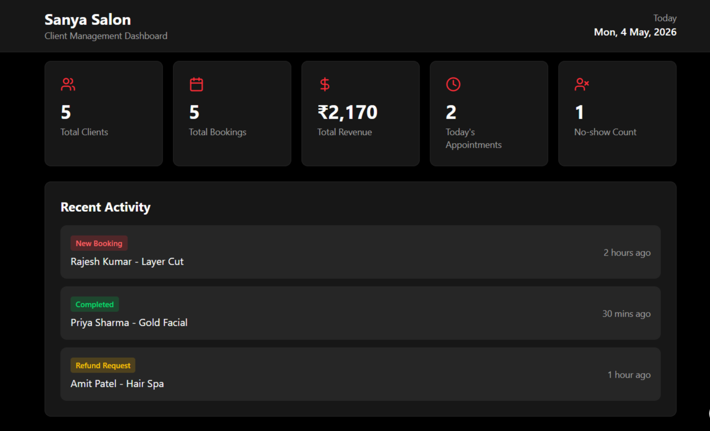
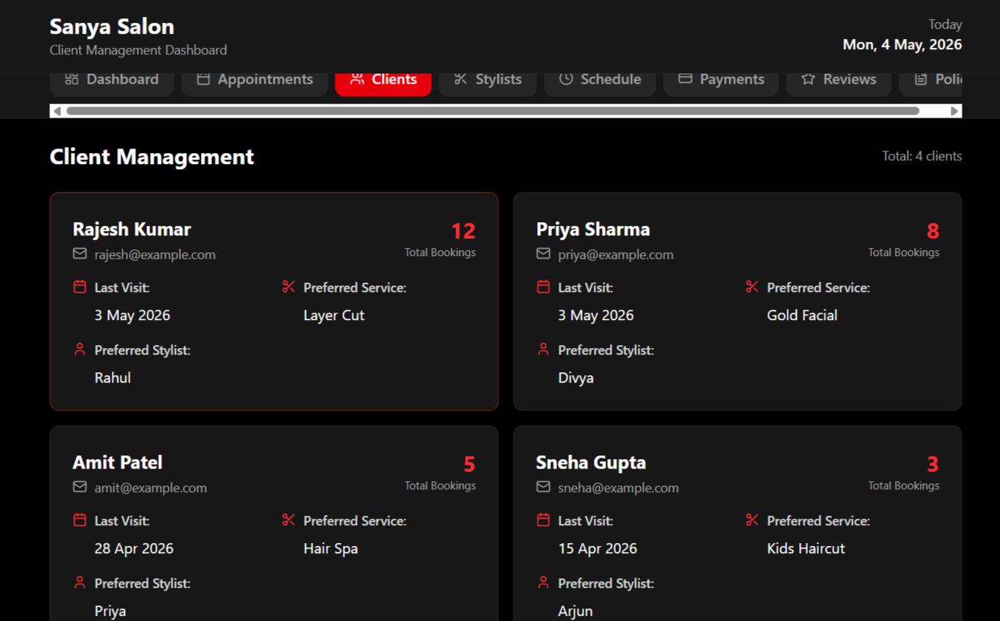

# FUTURE_UIUX_03
UI/UX Internship Task-Modern CRM dashboard UI for Sanya Salon with appointment ,client, stylist, payment and refund management
# 💇‍♀️ Sanya Salon – CRM Dashboard UI

## 📌 Overview
A modern CRM / Client Management Dashboard UI designed for salon owners to manage bookings, clients, payments, stylists, and business operations.

---

## ✨ Features
- Appointment management
- Client tracking
- Stylist availability
- Revenue overview
- Refund & no-show management
- Reviews & feedback

---

## 🛠️ Tools Used
- Figma
- GitHub

---

## 📸 Screenshots

